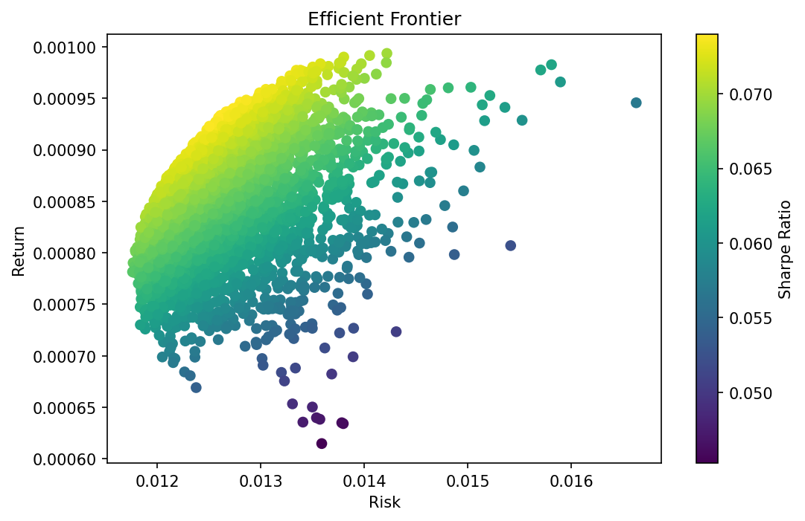
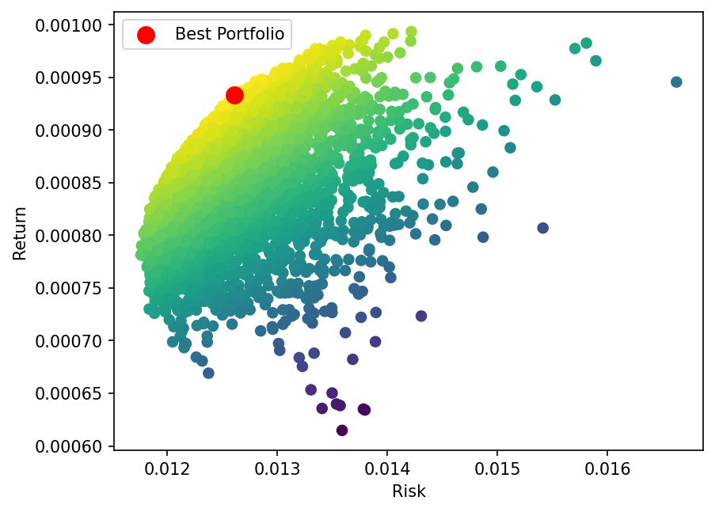
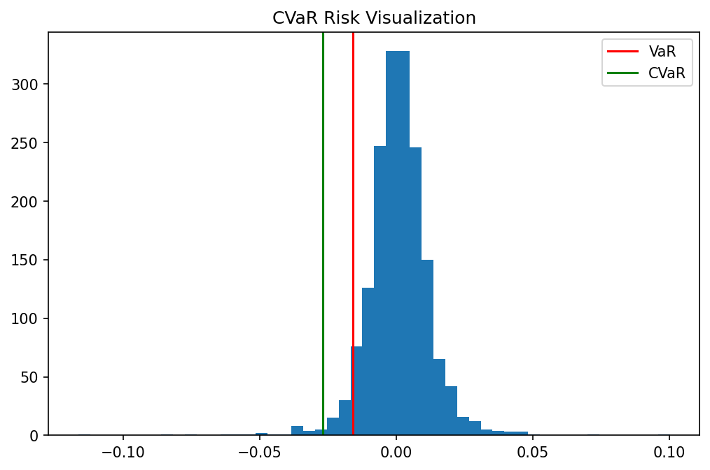
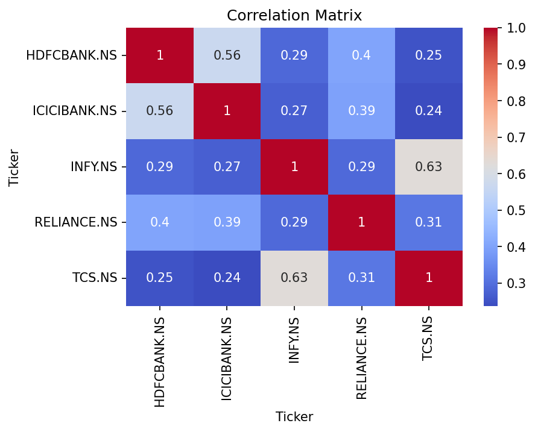
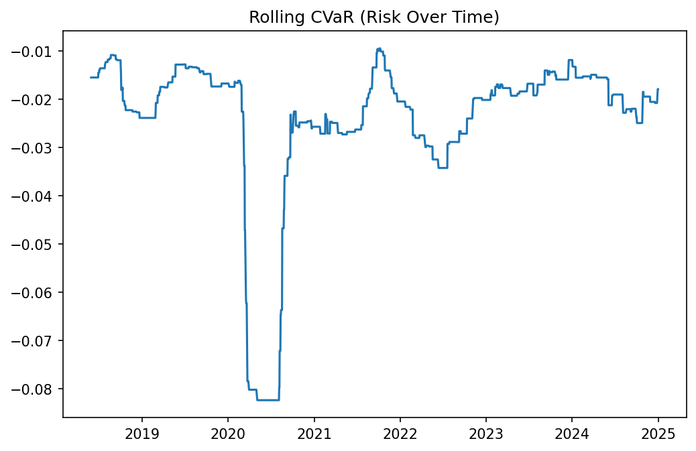

# 📊 Portfolio Optimization using MPT & CVaR

A Python-based quantitative finance project applying **Modern Portfolio Theory (MPT)** and **Conditional Value at Risk (CVaR)** to construct optimal portfolios using real NSE stock data (2018–2025).

---

## 🔗 View Full Notebook
👉 [Click here to view on nbviewer](https://nbviewer.org/github/Sarangamolambadkar/portfolio-optimization-mpt-cvar/blob/main/portfolio_optimization.ipynb)

---

## 🚀 Key Results

| Metric | Value |
|--------|-------|
| Portfolios Simulated | 5,000 |
| Annualized Return (Optimal) | ~23.9% |
| Annualized Volatility | ~20.3% |
| Annualized Sharpe Ratio | ~1.17 |
| CVaR Confidence Level | 95% |
| Data Period | 2018–2025 (7 years) |

---

## 📈 Efficient Frontier

> 5,000 simulated portfolios plotted. Color = Sharpe Ratio (brighter = better). The **red dot** marks the optimal portfolio — highest return for the lowest risk.

---

## 🎯 Best Portfolio

> The optimal portfolio achieves ~23.9% annualized return at ~20.3% volatility — Sharpe Ratio of ~1.17, well above the 1.0 benchmark.

---

## ⚠️ CVaR Risk Visualization

> Red line = VaR, Green line = CVaR at 95% confidence. CVaR reveals that in the worst 5% of trading days, losses were significantly deeper than standard deviation alone predicted.

---

## 🔗 Correlation Heatmap

> Shows how the 5 NSE stocks move relative to each other. TCS & Infosys (0.63) are most correlated. HDFC & TCS (0.25) are least — key for diversification.

---

## 📉 Rolling CVaR (Risk Over Time)

> 100-day rolling CVaR from 2018–2025. Notice the sharp spike in early 2020 (COVID crash) where CVaR dropped to -0.08, then stabilized post-2021.

---

## 📌 Stocks Analyzed

| Stock | Exchange |
|-------|----------|
| Reliance Industries | NSE |
| TCS | NSE |
| Infosys | NSE |
| HDFC Bank | NSE |
| ICICI Bank | NSE |

---

## ⚙️ Methodology

1. Fetched 7 years of historical price data via `yfinance`
2. Calculated daily returns and covariance matrix
3. Simulated 5,000 random portfolio weight combinations
4. Plotted Efficient Frontier — mapped risk vs return for all portfolios
5. Identified optimal portfolio by maximizing Sharpe Ratio
6. Measured tail risk using CVaR at 95% confidence level
7. Backtested and compared 3 strategies: Equal-Weight vs MPT vs CVaR

---

## 💡 Key Insights

- ✅ MPT-optimized portfolio achieved **~23.9% annualized return** at **~20.3% volatility** — Sharpe Ratio of **~1.17**
- ✅ Portfolios with risk > 0.014 delivered **no better return** than the optimal — more risk did not pay off
- ✅ CVaR revealed losses in the **worst 5% of days** were significantly deeper than standard deviation predicted
- ✅ Rolling CVaR spiked sharply during **COVID-19 (2020)** and stabilized post-2022

---

## 🛠️ Tech Stack

`Python` · `pandas` · `NumPy` · `yfinance` · `matplotlib` · `seaborn` · `scipy`

---

## 📂 Project Structure

```
portfolio-optimization-mpt-cvar/
│
├── portfolio_optimization.ipynb   # Main notebook
├── images/                        # Chart outputs
│   ├── efficient_frontier.png
│   ├── best_portfolio.png
│   ├── cvar_histogram.png
│   ├── correlation_heatmap.png
│   └── rolling_cvar.png
└── README.md
```

---

## 🚀 Future Improvements

- Add real-time data via live API
- Include transaction costs in optimization
- Expand to 10+ stocks across sectors
- Deploy as an interactive web app (Streamlit)

---

*Built as part of Finance & Data Analytics studies at VJTI Mumbai.*
